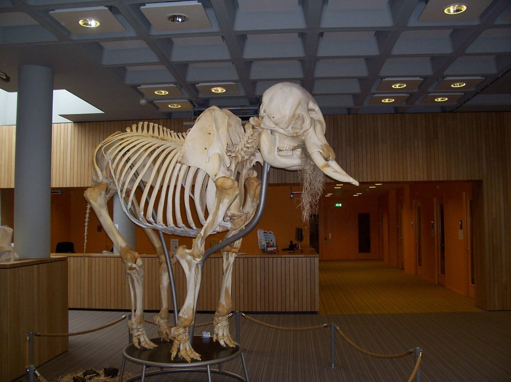

We are the Platform for Young Meta-Scientists (PYMS). PYMS was founded in May 2018 by a group of junior meta-scientists from universities in the Netherlands and neighbouring countries. We are brought together by our common interest in the science of science. In recent years, the field of meta-science has gained momentum and many new meta-science projects are being initiated, especially in the Netherlands. However, communication among the researchers involved with these projects did not always keep up. We decided to bundle our strengths into PYMS because we believe that sharing ideas and collaborating on projects makes science more efficient and fun.
Our general goal is to bring meta-scientists together at an early stage in their career to create awareness of each other’s work and build a useful academic network. Specifically, we host discussion and reading groups and keep each other updated on methodological developments, relevant conferences, workshops, and courses. We also regularly meet in a more formal capacity to share and discuss our research in a mini-conference setting.

Meta-scientists primarily study research practices, methods, epistemology, and sociological and historical aspects of science and scientists, often focussing on how science can become more reliable, reproducible, inclusive, efficient, or effective. Most of the PYMS founding members have a background in psychology, which is likely a result of recent efforts to improve research practices in this discipline. However, meta-science is an inherently interdisciplinary research area and draws on expertise from fields including, but not limited to, philosophy, history of science, statistics, psychology, and sociology. Consequently, PYMS is open to meta-researchers from all disciplines. As long as the goal is to conduct or discuss ‘science about science’, we are interested in connecting.

We decided to restrict our group to early-career researchers (graduate/PhD students and postdocs) because the flat hierarchy allows us to communicate more quickly and flexibly, and to offer each other a unique kind of peer support. The word ‘young’ in PYMS should thus be interpreted as referring to career stage; we explicitly welcome ‘junior’ meta-researchers of all ages.

PYMS has its geographical centre in the Netherlands, which is simply a result of the high density of meta-scientists in this area. Working at an institution in the Netherlands or nearby is not required for joining the group, but potential members should be aware that our meetings will predominantly be held in this region.

Finally, please meet the inspiration for our logo, the infamous Metaphant. This beauty sat beside the room at Utrecht University where we had our very first meeting, so we had no choice but to adopt it as our mascot.

