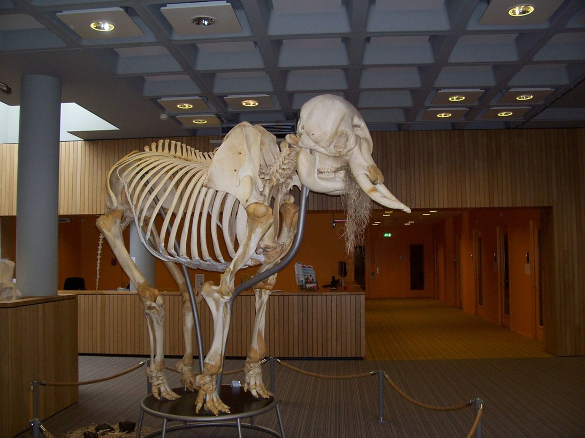

*last changed: 13-05-2026*

The Platform for Young Meta-Scientists (PYMS) is an international community for PhD students, postdocs, and other early-career researchers interested in meta-science and open science. Founded in 2018 by junior researchers in the Netherlands and neighbouring countries, PYMS was created to strengthen communication and collaboration within the growing field of meta-science.

Meta-science focuses on studying and improving scientific practices, methods, and research culture, with the goal of making science more reliable, reproducible, inclusive, and effective. Because meta-science is inherently interdisciplinary, PYMS welcomes researchers from a wide range of fields, including psychology, statistics, philosophy, sociology, ecology, and history of science.

PYMS aims to connect early-career researchers who are often spread across small and isolated groups worldwide. Through presentations, journal clubs, discussion groups, symposia, and networking events, the community creates opportunities for collaboration, peer support, and the exchange of ideas. Over the years, PYMS has grown into an active international network, with around 250 mailing list subscribers and more than 110 Discord members.

While PYMS has its geographical centre in the Netherlands, membership is open to researchers from anywhere in the world. The “young” in PYMS refers to career stage rather than age, and the community welcomes junior meta-researchers of all ages.

And finally, PYMS is proudly represented by the Metaphant — the community’s mascot, inspired by the elephant statue standing beside the room at Utrecht University where the first PYMS meeting took place.

